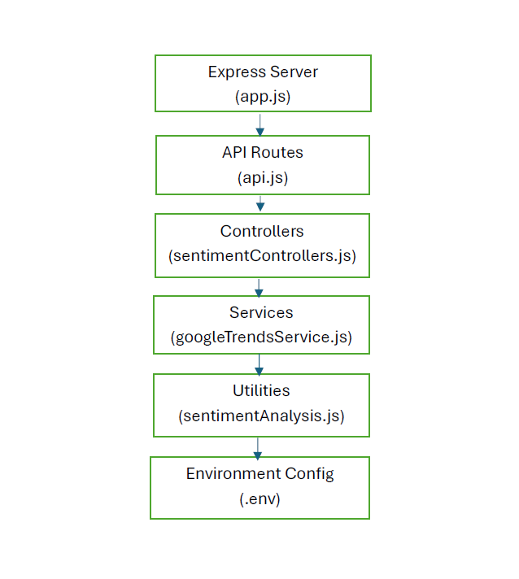

# CF-GREED_FEAR Index Application

## Project Overview

The CF-Greed_Fear Index Application is designed to help investors make informed decisions based on market sentiment. This application leverages data from the Google Trends API to analyze the sentiment of specific keywords related to cryptocurrency and forex markets. The goal is to provide an index that reflects the current market sentiment, indicating whether the market is experiencing fear or greed.

## Team Member
- [GIDEON OJIGI](https://github.com/gideon607)

## Table of Contents

- [Project Overview](#project-overview)
- [Team Member](#team-member)
- [Architecture](#architecture)
- [Technologies Used](#technologies-used)
- [Setup and Installation](#setup-and-installation)
- [Usage](#usage)
- [API Endpoints](#api-endpoints)
- [Development Report](#development-report)
- [Lessons Learned](#lessons-learned)
- [Next Steps](#next-steps)
- [License](#license)

## Architecture



The application consists of the following components:
- **Backend**: A Node.js server with Express.js that fetches and processes data from the Google Trends API.
- **API Endpoints**: Provides endpoints to fetch the Fear and Greed Index.
- **Sentiment Analysis**: Utilizes sentiment analysis to interpret Google Trends data and calculate the index.

## Technologies Used

- **Node.js**: JavaScript runtime environment.
- **Express.js**: Web framework for Node.js.
- **Google Trends API**: Data source for trends analysis.
- **Sentiment**: Sentiment analysis library.
- **dotenv**: Environment variables management.
- **npm**: Package manager.

## Setup and Installation

### Prerequisites

- Node.js (v12 or later)
- npm (v6 or later)

### Installation

1. **Clone the repository**:
    ```sh
    git clone https://github.com/your-username/CF-GREED_FEAR.git
    cd fear-and-greed-index
    ```

2. **Navigate to the backend directory**:
    ```sh
    cd backend
    ```

3. **Install dependencies**:
    ```sh
    npm install
    ```

4. **Set up environment variables**:
    Create a `.env` file in the `backend` directory and add your configurations:
    ```env
    PORT=5000
    ```

5. **Start the backend server**:
    ```sh
    npm start
    ```

## Usage

To fetch the Fear and Greed Index, make a GET request to the following endpoint:

```
http://localhost:5000/api/fear-greed
```

You can use tools like `curl`, Postman, or a web browser to access the endpoint.

## API Endpoints

### GET /api/fear-greed

Fetches the Fear and Greed Index based on Google Trends data.

#### Response
```json
{
  "fearGreedIndex": 75
}
```

## Development Report

### Successes

- Successfully integrated the Google Trends API.
- Developed an efficient backend to fetch and analyze trends data.
- Achieved accurate sentiment analysis from trends data.

### Challenges

- Limited data granularity from Google Trends.
- Handling asynchronous data fetching and processing.
- Ensuring accuracy in sentiment analysis.

### Areas for Improvement

- Enhance data processing algorithms for more accurate sentiment analysis.
- Implement additional data sources for a comprehensive index.
- Improve the backend's scalability and performance.

## Lessons Learned

- The importance of reliable third-party services.
- Effective collaboration and communication.
- Handling and processing large datasets.

## Next Steps

- Expand the data sources beyond Google Trends.
- Develop a frontend for better user interaction.
- Implement more sophisticated machine learning algorithms for sentiment analysis.

## License

This project is licensed under the MIT License. See the [LICENSE](LICENSE) file for details.
```

This `README.md` provides a comprehensive overview of the CF-GREED_FEAR project, making it easy for contributors to add their insight.
